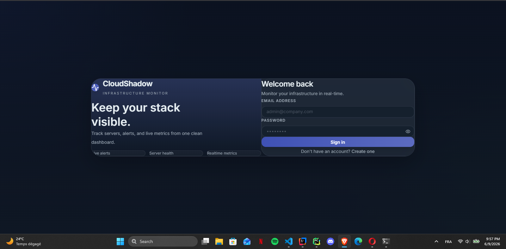
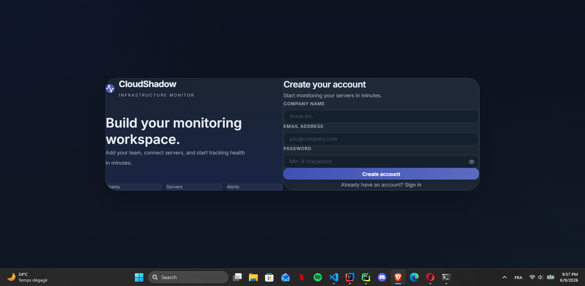
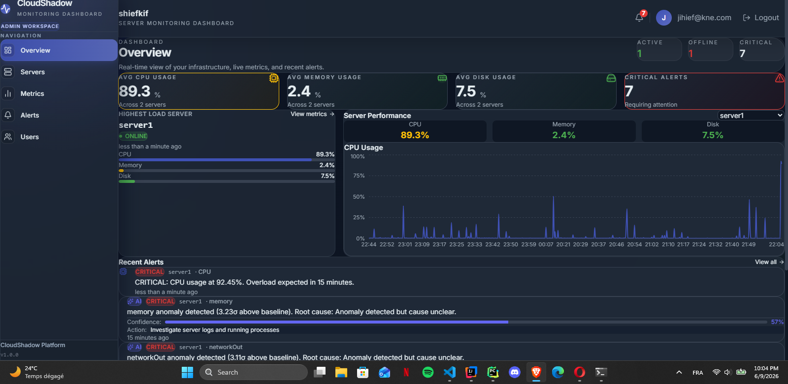
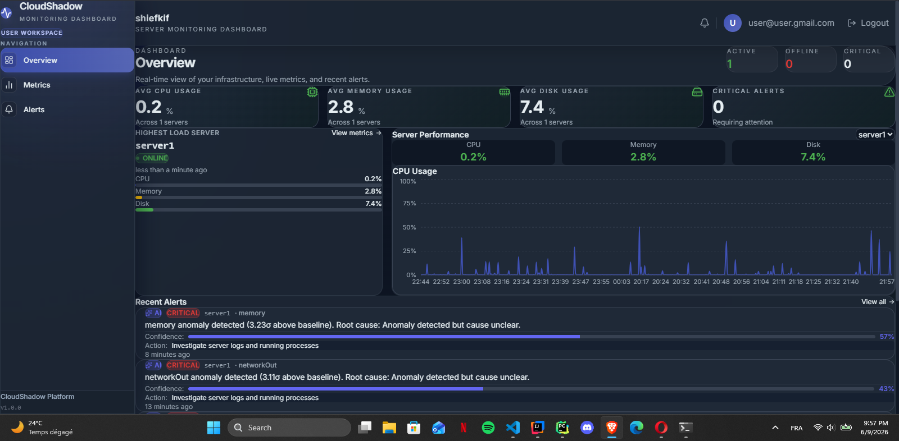
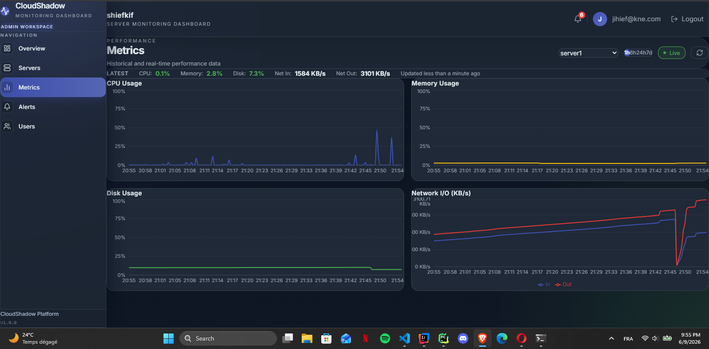
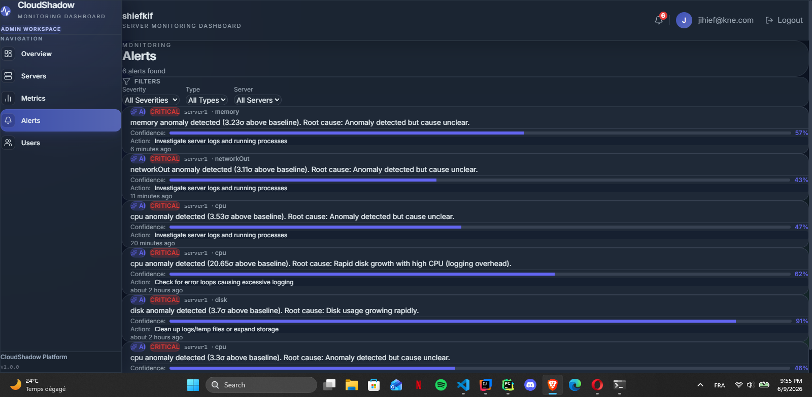
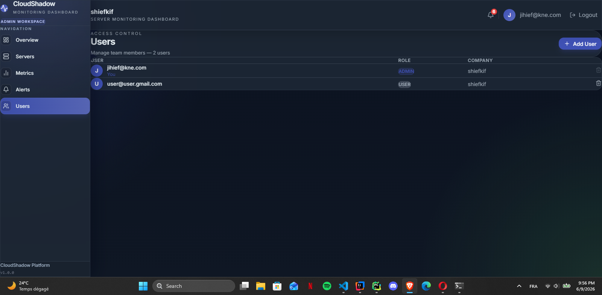
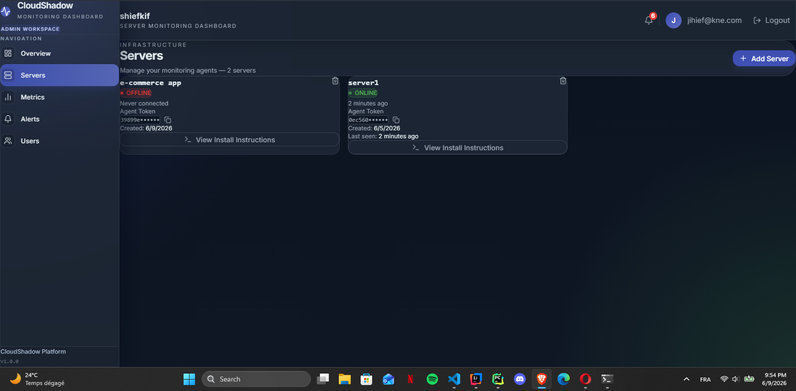
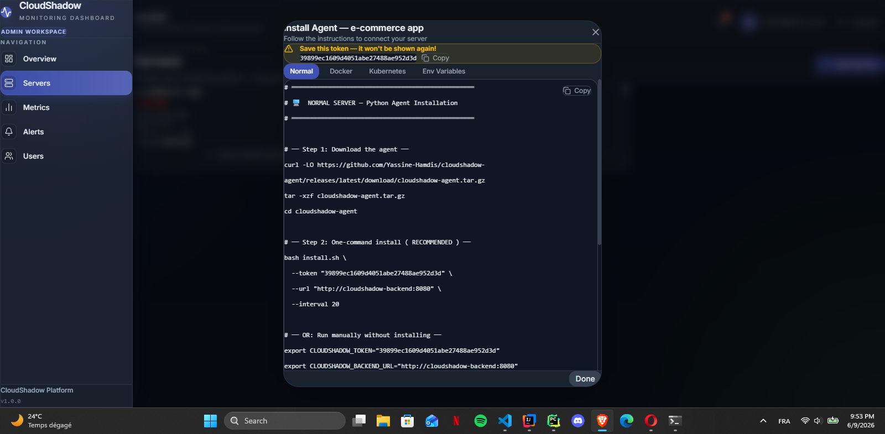

<div align="center">

# ☁️ CloudShadow

### Real-Time Server Monitoring Platform with AI-Powered Anomaly Detection


**Monitor your servers, Docker containers, and Kubernetes clusters in real-time with intelligent, AI-powered insights.**

[Overview](#-overview) •
[Features](#-features) •
[Screenshots](#-screenshots) •
[Architecture](#-architecture) •
[Tech Stack](#-tech-stack) •
[Quick Start](#-quick-start) •
[Deployment](#-deployment) •
[Contributing](#-contributing)

</div>

---

## 📋 Table of Contents

- [Overview](#-overview)
- [Features](#-features)
- [Architecture](#-architecture)
- [Tech Stack](#-tech-stack)
- [Project Structure](#-project-structure)
- [Prerequisites](#-prerequisites)
- [Quick Start](#-quick-start)
  - [Local Development](#1-local-development)
  - [Docker Compose](#2-docker-compose)
  - [Kubernetes (Minikube)](#3-kubernetes-minikube)
- [Deployment](#-deployment)
  - [AWS with Terraform](#aws-with-terraform)
  - [DigitalOcean](#digitalocean)
  - [CI/CD Pipeline](#cicd-pipeline)
- [Monitoring Agents](#-monitoring-agents)
- [API Documentation](#-api-documentation)
- [Contributing](#-contributing)
- [License](#-license)

---

## 🔭 Overview

CloudShadow is a **production-grade server monitoring platform** built with modern microservices architecture. It enables companies to monitor their infrastructure in real-time with:

- **Real-time metrics** via WebSocket/STOMP
- **AI-powered anomaly detection** using statistical analysis (Z-score)
- **Predictive alerts** using Linear Regression models
- **Root cause analysis** with metric correlation engine
- **Multi-tenant isolation** with JWT authentication
- **Multi-platform support** (physical servers, Docker, Kubernetes)

### What makes it different?

| Traditional Monitoring | CloudShadow |
|---|---|
| "CPU is at 92%" | "CPU is 3.2σ above baseline. Predicted to hit 100% in 18 minutes. Root cause: Network traffic spike (5x). Recommended: Enable rate limiting." |
| Threshold-based alerts | AI-powered predictive alerts with confidence scores |
| Manual investigation | Automatic root cause analysis |

---

## ✨ Features

### 🔐 Multi-Tenant Authentication
- Company registration with complete data isolation
- JWT-based authentication with configurable expiration
- Role-based access control (ADMIN / USER)
- Secure token storage for monitoring agents

### 📊 Real-Time Monitoring
- WebSocket push via STOMP protocol with SockJS fallback
- Live CPU, Memory, Disk, Network charts with Recharts
- Server online/offline detection with automatic status updates
- Per-company topic isolation for data privacy

### 🤖 AI-Powered Analysis
- **Trend Prediction** using Linear Regression
  - Predicts when metrics will hit critical thresholds
  - Example: "CPU will reach 90% in ~25 minutes"
- **Anomaly Detection** using Z-score statistics
  - Detects spikes above server's baseline (>2.5σ)
  - Confidence score per alert
- **Root Cause Analysis** via metric correlation engine
  - Cross-correlates CPU, Memory, Disk, Network metrics
  - Provides actionable recommendations

### 🐳 Multi-Platform Monitoring Agents
- **Normal Server Agent** → Physical/VM servers (Python + psutil)
- **Docker Sidecar Agent** → Docker containers (Docker SDK)
- **Kubernetes DaemonSet Agent** → K8s clusters (K8s metrics API)

### 🚨 Smart Alert System
- Threshold-based alerts (instant, real-time)
- AI-generated predictive alerts (scheduled, pattern-based)
- Alert deduplication to prevent notification spam
- Severity levels: WARNING / CRITICAL
- Filter and manage alerts by type, severity, server

### ⚙️ Server Management
- Auto-generated install instructions per deployment type
- Token-based agent authentication
- Support for Normal / Docker / Kubernetes deployments
- Secure token storage (shown once, managed securely)

---

## 📸 Screenshots

### Authentication

<p align="center">
  
  
</p>

### Dashboard Overview for Admin

<p align="center">
  
</p>

### User Management

<p align="center">
  
</p>

### Monitoring & Analytics

<p align="center">
  
  
</p>

### Administration

<p align="center">
  
  
</p>

### Installation Guide

<p align="center">
  
</p>

---

## 🏗️ Architecture

### System Overview

```
┌─────────────────────────────────────────────────────────────────┐
│ CLIENT LAYER                                                    │
│ React + Vite Dashboard (Tailwind CSS, Dark Theme)               │
└───────────────────────────┬─────────────────────────────────────┘
                            │ HTTP / WebSocket
                            ▼
┌─────────────────────────────────────────────────────────────────┐
│ INGRESS LAYER                                                   │
│ CloudFront (CDN) → Nginx Ingress Controller / ALB               │
│ Routes: /api → Backend | /ws → Backend | / → Frontend          │
└───────────────────────────┬─────────────────────────────────────┘
                            │
        ┌───────────────────┼───────────────────┐
        ▼                   ▼                   ▼
┌─────────────────┐  ┌──────────────────┐  ┌────────────────┐
│ Spring Boot     │  │ Python AI        │  │ React Frontend │
│ Backend         │  │ Service (FastAPI)│  │ (Nginx)        │
│ (EKS Pod)       │  │ (EKS Pod)        │  │ (S3 + CF)      │
│                 │  │                  │  │                │
│ • REST API      │  │ • Trend          │  │ • Dashboard    │
│ • JWT Security  │  │   Prediction     │  │ • Recharts     │
│ • WebSocket     │  │ • Z-score        │  │ • Zustand      │
│ • Multi-tenant  │  │   Anomaly        │  │ • SockJS       │
│ • Flyway        │  │ • Root Cause     │  └────────────────┘
└────────┬────────┘  │   Analysis       │
         │           └──────────────────┘
         │
    ┌────▼──────────────────┐
    │ AWS RDS MySQL         │
    │ - Flyway migrations   │
    │ - Automated backups   │
    │ - Multi-AZ support    │
    └───────────────────────┘

┌─────────────────────────────────────────────────────────────────┐
│ MONITORING AGENTS                                               │
│ 🖥️  Normal Agent   → Physical/VM servers (psutil)               │
│ 🐳 Docker Agent  → Container monitoring (Docker SDK)           │
│ ☸️  K8s DaemonSet → Node monitoring (K8s metrics API)          │
│                                                                 │
│ All agents POST to /api/metrics using server token             │
└─────────────────────────────────────────────────────────────────┘
```

### AWS Infrastructure with Terraform

```
└── terraform/modules/
    ├── vpc/          → VPC, Subnets, NAT Gateway, Security Groups
    ├── eks/          → EKS Cluster, Node Groups, RBAC
    ├── rds/          → RDS MySQL (Multi-AZ), Parameter Groups
    ├── s3/           → S3 bucket for future MLflow storage (MLOps)
    ├── s3_frontend/  → S3 bucket for React static assets
    └── cloudfront/   → CloudFront distribution for CDN
```

**Deployment Architecture:**
- **VPC**: Private subnets for workloads, public subnets for NAT/Ingress
- **EKS**: Managed Kubernetes cluster with auto-scaling node groups
- **RDS**: Managed MySQL database with automated backups and failover
- **S3 Frontend**: Static asset hosting for React SPA
- **CloudFront**: Global CDN for low-latency frontend delivery
- **ALB/NLB**: Application Load Balancer routing traffic to Ingress Controller

---

## 🛠️ Tech Stack

### Backend
| Technology | Purpose |
|-----------|---------|
| Java 17 | Core language |
| Spring Boot 4.x | Application framework |
| Spring Security + JWT | Authentication & authorization |
| Spring Data JPA | Database ORM |
| WebSocket + STOMP + SockJS | Real-time communication |
| **Flyway** | Database schema migrations (production-grade) |
| MySQL 8.0 | Primary database |
| Lombok | Boilerplate reduction |

### Frontend
| Technology | Purpose |
|-----------|---------|
| React + Vite | UI framework with fast dev/build |
| Tailwind CSS | Utility-first styling (dark theme) |
| Recharts | Interactive metric charts |
| Zustand | Lightweight global state management |
| Axios | HTTP client |
| SockJS + STOMP | WebSocket client with fallback |
| React Router | Client-side navigation |

### AI Microservice
| Technology | Purpose |
|-----------|---------|
| Python 3.11 | Core language |
| FastAPI | REST API framework |
| scikit-learn | Linear Regression (trend prediction) |
| NumPy | Statistical analysis (Z-score anomaly detection) |
| Pydantic | Request/response validation |

### Infrastructure & DevOps
| Technology | Purpose |
|-----------|---------|
| Docker | Container runtime |
| Kubernetes (EKS) | Container orchestration on AWS |
| **Helm** | K8s package management |
| **Terraform** | Infrastructure-as-Code (AWS provisioning) |
| Nginx Ingress | HTTP traffic routing |
| CloudFront | CDN for frontend |
| GitHub Actions | CI/CD automation |

---

## 📁 Project Structure

```
CloudShadow-Monorepo/
│
├── backend/                          # Spring Boot application
│   ├── src/main/java/com/yassine/cloudshadow/
│   │   ├── config/                   # Security, WebSocket, RestTemplate
│   │   ├── controller/               # REST API endpoints
│   │   ├── dto/                      # Request/Response DTOs
│   │   ├── entity/                   # JPA entities
│   │   ├── exception/                # Global exception handler
│   │   ├── repository/               # Spring Data JPA repositories
│   │   ├── scheduler/                # Scheduled tasks (AI analysis)
│   │   ├── service/                  # Business logic
│   │   └── websocket/                # WebSocket message handling
│   ├── src/main/resources/
│   │   ├── db/migration/             # Flyway SQL migrations
│   │   └── application*.properties   # Environment configuration
│   └── pom.xml
│
├── frontend/                         # React + Vite application
│   ├── src/
│   │   ├── api/                      # Axios instances & API calls
│   │   ├── components/               # Reusable React components
│   │   ├── pages/                    # Route pages (Dashboard, Alerts, etc.)
│   │   ├── store/                    # Zustand store definitions
│   │   ├── websocket/                # WebSocket connection hook
│   │   └── main.jsx
│   ├── nginx.conf                    # Nginx config for SPA routing
│   └── vite.config.js
│
├── ai-service/                       # Python FastAPI microservice
│   ├── app/
│   │   ├── models/                   # ML models (Predictor, Anomaly)
│   │   ├── engine/                   # Root cause analysis engine
│   │   ├── analyzer.py               # Main analysis pipeline
│   │   ├── schemas.py                # Pydantic request/response models
│   │   └── main.py                   # FastAPI application
│   ├── requirements.txt
│   └── Dockerfile
│
├── agents/                           # Monitoring agents
│   ├── agent/                        # Normal server agent (Python)
│   ├── docker-agent/                 # Docker container agent
│   └── k8s-agent/                    # Kubernetes DaemonSet agent
│
├── k8s/                              # Kubernetes manifests (raw YAML)
│   ├── mysql/
│   ├── backend/
│   ├── ai-service/
│   ├── frontend/
│   ├── ingress/
│   └── monitoring/                   # DaemonSet + RBAC
│
├── helm/cloudshadow/                 # Helm chart for production
│   ├── Chart.yaml
│   ├── values.yaml
│   ├── values-prod.yaml
│   └── templates/
│       ├── deployment.yaml
│       ├── service.yaml
│       ├── ingress.yaml
│       └── ...
│
├── terraform/                        # Infrastructure-as-Code (AWS)
│   ├── modules/
│   │   ├── vpc/                      # VPC, Subnets, Security Groups
│   │   ├── eks/                      # EKS Cluster, Node Groups
│   │   ├── rds/                      # RDS MySQL instance
│   │   ├── s3/                       # S3 for MLflow storage
│   │   ├── s3_frontend/              # S3 for React frontend
│   │   └── cloudfront/               # CloudFront CDN
│   ├── main.tf                       # Root module
│   ├── variables.tf
│   ├── outputs.tf
│   └── terraform.tfvars.example
│
├── .github/workflows/                # GitHub Actions CI/CD
│   ├── backend.yml                   # Build & deploy backend
│   ├── frontend.yml                  # Build & deploy frontend
│   ├── ai-service.yml                # Build & deploy AI service
│   └── agents.yml                    # Build & push agent images
│
├── docker-compose.yml                # Local development stack
├── docker-compose.demo.yml           # Demo with monitoring agent
└── README.md                         # This file
```

---

## 📋 Prerequisites

### Required
- **Java 17+** - [Download](https://www.oracle.com/java/technologies/downloads/#java17)
- **Node.js 18+** - [Download](https://nodejs.org/)
- **Python 3.11+** - [Download](https://www.python.org/)
- **Docker & Docker Compose** - [Download](https://www.docker.com/products/docker-desktop)
- **MySQL 8.0** (or use Docker) - [Download](https://dev.mysql.com/downloads/)

### For Kubernetes
- **kubectl** - [Install](https://kubernetes.io/docs/tasks/tools/)
- **Helm 3+** - [Install](https://helm.sh/docs/intro/install/)
- **Minikube** (local) or **AWS account** (cloud) - [Install Minikube](https://minikube.sigs.k8s.io/docs/start/)

### For AWS Terraform Deployment
- **Terraform 1.5+** - [Install](https://developer.hashicorp.com/terraform/install)
- **AWS CLI v2** - [Install](https://docs.aws.amazon.com/cli/latest/userguide/getting-started-install.html)
- **AWS Account** with appropriate IAM permissions (EC2, EKS, RDS, S3, CloudFront)

---

## 🚀 Quick Start

### 1. Local Development

Clone the repository:
```bash
git clone https://github.com/Yassine-Hamdis/CloudShadow-Monorepo.git
cd CloudShadow-Monorepo
```

**Start AI Service (Python):**
```bash
cd ai-service
python -m venv venv
source venv/bin/activate  # Windows: venv\Scripts\activate
pip install -r requirements.txt
uvicorn app.main:app --reload --port 8000
# Visit http://localhost:8000/docs for Swagger UI
```

**Start Backend (Java):**
```bash
cd backend
# Update application.properties with your MySQL credentials
mvn clean install
mvn spring-boot:run
# API available at http://localhost:8080
```

**Start Frontend (React):**
```bash
cd frontend
npm install
npm run dev
# Visit http://localhost:5173
```

---

### 2. Docker Compose

**Fastest way to run the full stack locally:**

```bash
# Create environment file
cp .env.example .env
# Edit .env with your values (default values work for local dev)

# Start all services
docker-compose up -d

# Access the application
# Frontend:    http://localhost:80
# Backend API: http://localhost:8080
# AI Service:  http://localhost:8000/docs
```

**Demo with monitoring agent:**
```bash
# First, create a server in the dashboard and copy the token
# Then update .env: AGENT_SERVER_TOKEN=your-token

docker-compose -f docker-compose.yml \
               -f docker-compose.demo.yml up -d

# Watch metrics flow in real-time
```

**Stop all services:**
```bash
docker-compose down
```

---

### 3. Kubernetes (Minikube)

**Local testing with Minikube:**

```bash
# Start Minikube with sufficient resources
minikube start --memory=4096 --cpus=2
minikube addons enable ingress
minikube addons enable metrics-server

# Deploy using Helm
helm upgrade --install cloudshadow ./helm/cloudshadow \
  --namespace cloudshadow \
  --create-namespace \
  --values helm/cloudshadow/values.yaml

# Watch pods startup
kubectl get pods -n cloudshadow -w

# Get Minikube IP and access the application
minikube ip
# Visit http://<minikube-ip>

# View logs
kubectl logs -n cloudshadow -l app=backend -f
kubectl logs -n cloudshadow -l app=ai-service -f

# Cleanup
helm uninstall cloudshadow -n cloudshadow
```

---

## 🚀 Deployment

### AWS with Terraform

**Setup AWS credentials:**
```bash
aws configure
# Enter your AWS Access Key ID, Secret Access Key, region, etc.
```

**Initialize and plan infrastructure:**
```bash
cd terraform

# Copy and customize variables
cp terraform.tfvars.example terraform.tfvars
# Edit terraform.tfvars with your desired configuration

# Initialize Terraform
terraform init

# Plan the deployment (review what will be created)
terraform plan -out=tfplan

# Apply the configuration
terraform apply tfplan
```

**Deploy applications to EKS:**
```bash
# Configure kubectl to use the new EKS cluster
aws eks update-kubeconfig --name cloudshadow-cluster --region us-east-1

# Verify connection
kubectl get nodes

# Deploy using Helm
helm upgrade --install cloudshadow ./helm/cloudshadow \
  --namespace cloudshadow \
  --create-namespace \
  --values helm/cloudshadow/values-prod.yaml \
  --set image.tag=latest

# Monitor deployment
kubectl get pods -n cloudshadow -w

# Get the CloudFront URL
terraform output cloudfront_domain_name
```

**Cleanup AWS resources:**
```bash
# Delete Helm release
helm uninstall cloudshadow -n cloudshadow

# Destroy infrastructure
terraform destroy
```

### DigitalOcean

**Create a Kubernetes cluster:**
```bash
doctl kubernetes cluster create cloudshadow-cluster \
  --region fra1 \
  --size s-2vcpu-4gb \
  --count 2

# Save kubeconfig
doctl kubernetes cluster kubeconfig save cloudshadow-cluster

# Install Nginx Ingress
kubectl apply -f https://raw.githubusercontent.com/kubernetes/ingress-nginx/controller-v1.8.2/deploy/static/provider/do/deploy.yaml
```

**Deploy with Helm:**
```bash
helm upgrade --install cloudshadow ./helm/cloudshadow \
  --namespace cloudshadow \
  --create-namespace \
  --set publicUrl=http://YOUR-EXTERNAL-IP \
  --set mysql.storageClass=do-block-storage

# Get external IP
kubectl get ingress -n cloudshadow
```

### CI/CD Pipeline

**GitHub Actions Workflows:**

Four automated workflows trigger on code changes:

| Trigger | Workflow | Action |
|---------|----------|--------|
| `backend/**` | `backend.yml` | Build JAR → Docker → Push → Deploy to EKS |
| `frontend/**` | `frontend.yml` | Build React → Docker → Push → Deploy to EKS |
| `ai-service/**` | `ai-service.yml` | Validate Python → Docker → Push → Deploy to EKS |
| `agent/**` | `agents.yml` | Build all agents → Push to Docker Hub |

**Required GitHub Secrets:**
```
DOCKERHUB_USERNAME       → yacinham10
DOCKERHUB_TOKEN          → Docker Hub access token
AWS_ACCESS_KEY_ID        → AWS credentials
AWS_SECRET_ACCESS_KEY    → AWS credentials
KUBECONFIG               → kubectl config (base64 encoded)
```

**Setup:**
```bash
# 1. Encode kubeconfig
cat ~/.kube/config | base64 | pbcopy  # macOS
# Or on Linux: cat ~/.kube/config | base64

# 2. Add as GitHub secret named KUBECONFIG

# 3. Push to main branch and watch CI/CD run
git push origin main
```

---

## 📡 Monitoring Agents

### 1. Normal Server Agent (Linux/macOS/Windows)

Monitor physical servers and VMs:

```bash
# Download and install
curl -LO https://github.com/Yassine-Hamdis/cloudshadow-agent/releases/latest/download/cloudshadow-agent.tar.gz
tar -xzf cloudshadow-agent.tar.gz
cd cloudshadow-agent

bash install.sh \
  --token "your-server-token" \
  --url "http://your-backend-url" \
  --interval 20

# Verify installation
systemctl status cloudshadow-agent
```

**Collected metrics:** CPU%, Memory%, Disk%, Network In/Out KB/s

### 2. Docker Sidecar Agent

Monitor containers via Docker socket:

```yaml
# Add to your docker-compose.yml
cloudshadow-agent:
  image: yacinham10/cloudshadow-docker-agent:latest
  environment:
    SERVER_TOKEN: "your-server-token"
    BACKEND_URL: "http://your-backend-url"
    MONITOR_CONTAINER: "your-app-container-name"
    INTERVAL: "20"
  volumes:
    - /var/run/docker.sock:/var/run/docker.sock
  depends_on:
    - your-app-container-name
```

**Collected metrics:** Container CPU%, Memory%, Block I/O, Network bytes

### 3. Kubernetes DaemonSet Agent

Automatic monitoring on every Kubernetes node:

```bash
# Create namespace and secret
kubectl create namespace monitoring
kubectl create secret generic agent-secret \
  --namespace monitoring \
  --from-literal=server-token="your-server-token"

# Create configmap
kubectl create configmap agent-config \
  --namespace monitoring \
  --from-literal=BACKEND_URL="http://your-backend-public-url" \
  --from-literal=INTERVAL="20"

# Apply RBAC and DaemonSet
kubectl apply -f https://github.com/Yassine-Hamdis/cloudshadow-agent/releases/latest/download/k8s-rbac.yaml
kubectl apply -f https://github.com/Yassine-Hamdis/cloudshadow-agent/releases/latest/download/k8s-daemonset.yaml

# Verify (one pod per node)
kubectl get pods -n monitoring -o wide
```

**Collected metrics:** Node CPU%, Memory% (K8s metrics API), Disk%, Network KB/s

---

## 📚 API Documentation

### Authentication

**Register a company:**
```bash
POST /api/auth/register
Content-Type: application/json

{
  "companyName": "TechCorp",
  "email": "admin@techcorp.com",
  "password": "password123"
}

# Response
{
  "token": "eyJhbGciOiJIUzI1NiIsInR5cCI6IkpXVCJ9...",
  "userId": 1,
  "companyId": 1,
  "role": "ADMIN"
}
```

**Login:**
```bash
POST /api/auth/login
Content-Type: application/json

{
  "email": "admin@techcorp.com",
  "password": "password123"
}
```

**Use JWT token in requests:**
```bash
Authorization: Bearer <your-jwt-token>
```

### Core Endpoints

| Method | Endpoint | Auth | Description |
|--------|----------|------|-------------|
| POST | `/api/auth/register` | Public | Register company |
| POST | `/api/auth/login` | Public | Login |
| POST | `/api/metrics` | Token | Agent sends metrics |
| GET | `/api/metrics` | JWT | Get all metrics |
| GET | `/api/metrics/server/{id}/latest` | JWT | Latest metric |
| GET | `/api/metrics/range?from=&to=` | JWT | Time range query |
| GET | `/api/alerts` | JWT | All alerts |
| GET | `/api/alerts/severity/{severity}` | JWT | Filter by severity |
| GET | `/api/alerts/critical/count` | JWT | Critical count badge |
| POST | `/api/servers` | JWT+ADMIN | Add server |
| GET | `/api/servers` | JWT | List servers |
| DELETE | `/api/servers/{id}` | JWT+ADMIN | Delete server |
| POST | `/api/users` | JWT+ADMIN | Create user |
| GET | `/api/users` | JWT+ADMIN | List users |

**Full API Documentation:** After starting the backend, visit `http://localhost:8080/swagger-ui.html` (Swagger UI)

### WebSocket Events

**Connect:**
```javascript
// After authentication, connect to WebSocket
const stompClient = new StompJs.Client({
  brokerURL: 'ws://your-backend/ws',
  onConnect: () => {
    const companyId = getCurrentCompanyId();
    
    // Subscribe to metrics
    stompClient.subscribe(`/topic/company/${companyId}/metrics`, onMetric);
    
    // Subscribe to alerts
    stompClient.subscribe(`/topic/company/${companyId}/alerts`, onAlert);
    
    // Subscribe to server status
    stompClient.subscribe(`/topic/company/${companyId}/status`, onStatus);
  }
});
```

**Message Types:**

| Type | Payload | Action |
|------|---------|--------|
| `NEW_METRIC` | MetricResponse | Update charts with new data |
| `NEW_ALERT` | AlertResponse | Show toast notification + add to alert list |
| `SERVER_ONLINE` | ServerStatusPayload | Display green online badge |
| `SERVER_OFFLINE` | ServerStatusPayload | Display red offline badge |

---

## 🤖 AI Service

The AI microservice runs as a separate FastAPI service and analyzes metrics every 60 seconds per server.

**Analysis Pipeline:**

```
Last 30 metrics per server
         │
         ▼
┌─────────────────────────┐
│  1. Trend Predictor     │  Uses Linear Regression
│     Will CPU hit 90%?   │  to predict threshold
│     → In ~25 minutes    │  breach timing
└────────────┬────────────┘
             │
             ▼
┌─────────────────────────┐
│  2. Anomaly Detector    │  Uses Z-score analysis
│     Is this abnormal?   │  (>2.5σ = anomaly)
│     → 97% confidence    │  Per-server baseline
└────────────┬────────────┘
             │
             ▼
┌─────────────────────────┐
│  3. Root Cause Engine   │  Correlates metrics
│     WHY is it spiking?  │  across CPU, Memory,
│     → Network issue     │  Disk, Network
└────────────┬────────────┘
             │
             ▼
    AI Alert Created
    ├─ Type: ANOMALY_DETECTION
    ├─ Severity: CRITICAL
    ├─ Confidence: 97%
    ├─ Message: "CPU spike caused by 5x network traffic"
    └─ Recommendation: "Enable rate limiting"
```

**AI Service API:**

```bash
# Health check
GET http://localhost:8000/health

# Analyze metrics
POST http://localhost:8000/analyze
Content-Type: application/json

{
  "server_id": 1,
  "company_id": 1,
  "metrics": [
    { "timestamp": "2024-01-15T10:00:00Z", "cpu": 45.2, "memory": 60.5, "disk": 75.0, "network_io": 102.3 },
    ...
  ]
}

# Response
{
  "alerts": [
    {
      "type": "ANOMALY_DETECTION",
      "severity": "CRITICAL",
      "confidence": 0.97,
      "metric": "cpu",
      "message": "CPU spike detected",
      "recommendation": "Check background processes"
    },
    {
      "type": "PREDICTION",
      "severity": "WARNING",
      "confidence": 0.85,
      "metric": "memory",
      "message": "Memory will exceed 95% in 30 minutes",
      "recommendation": "Increase swap or add RAM"
    }
  ]
}

# API Documentation
GET http://localhost:8000/docs  # Swagger UI
```

---

## 🔐 Environment Variables

### Backend (`application.properties`)
```properties
# Database
spring.datasource.url=jdbc:mysql://mysql:3306/cloudShadowdb
spring.datasource.username=cloudshadow_user
spring.datasource.password=your_secure_password

# JWT
jwt.secret=your-super-secret-jwt-key-at-least-256-bits-long
jwt.expiration=86400000  # 24 hours

# AI Service
ai.service.url=http://ai-service:8000

# Server URLs
cloudshadow.backend.public-url=http://your-public-ip:8080

# Logging
logging.level.root=INFO
logging.level.com.yassine.cloudshadow=DEBUG
```

### Frontend (`.env`)
```
VITE_API_BASE_URL=http://your-backend-url
VITE_WS_URL=ws://your-backend-url/ws
```

### Monitoring Agents
```bash
# Environment variables or config file
SERVER_TOKEN=your-server-token        # Required
BACKEND_URL=http://your-backend-url   # Required
INTERVAL=20                            # Optional (default: 20 seconds)
MONITOR_CONTAINER=container-name      # Docker agent only
NODE_NAME=node-name                   # K8s agent only (auto-injected)
```

---

## 📊 Database Schema

CloudShadow uses **Flyway** for automated database migrations. All schema changes are version-controlled in `backend/src/main/resources/db/migration/`.

**Key tables:**
- `companies` - Multi-tenant company isolation
- `users` - Company users with roles
- `servers` - Server configurations and tokens
- `metrics` - Time-series metric data
- `alerts` - Generated alerts (threshold-based + AI)
- `alert_history` - Alert acknowledgments and actions

**Flyway features used:**
- ✅ Versioned migrations (V001__, V002__, etc.)
- ✅ Repeatable migrations for seed data
- ✅ SQL-based schemas for MySQL compatibility
- ✅ Automatic rollback on migration failure

---

## 🔄 CI/CD Pipeline

**GitHub Actions Workflows:**

Each service has its own automated pipeline that:
1. Triggers on code changes to its directory
2. Builds and tests the service
3. Creates a Docker image
4. Pushes to Docker Hub
5. Deploys to EKS cluster (if configured)

```
Push to main branch
     │
     ├── backend/changed?   → Build JAR → Docker → Push → Deploy
     │
     ├── frontend/changed?  → Build React → Docker → Push → Deploy
     │
     ├── ai-service/changed? → Validate Python → Docker → Push → Deploy
     │
     └── agent/changed?     → Build agents → Push to registry
```

**Check workflow status:**
```bash
# View GitHub Actions runs
open https://github.com/Yassine-Hamdis/CloudShadow-Monorepo/actions

# Or from CLI with GitHub CLI
gh run list
gh run view <run-id> --log
```

---

## 🤝 Contributing

Contributions are welcome! Please follow these steps:

1. **Fork the repository**
   ```bash
   # Click the Fork button on GitHub
   ```

2. **Create a feature branch**
   ```bash
   git checkout -b feature/your-feature-name
   ```

3. **Make your changes**
   - Follow existing code style
   - Add tests if applicable
   - Update documentation

4. **Commit with clear messages**
   ```bash
   git commit -m "feat: add real-time alert notifications"
   ```

5. **Push and create a Pull Request**
   ```bash
   git push origin feature/your-feature-name
   # Open PR on GitHub
   ```

6. **Code Review**
   - Address feedback from maintainers
   - Ensure CI/CD passes

---

## 📝 License

This project is licensed under the **MIT License** - see the [LICENSE](LICENSE) file for details.

---

## 🗺️ Roadmap

**Completed ✅**
- [x] Multi-tenant JWT authentication
- [x] Real-time WebSocket metrics (STOMP)
- [x] AI-powered anomaly detection (Z-score)
- [x] Trend prediction (Linear Regression)
- [x] Root cause analysis engine
- [x] Normal/Docker/Kubernetes agents
- [x] GitHub Actions CI/CD pipelines
- [x] Helm charts for Kubernetes deployment
- [x] Flyway database migrations
- [x] Terraform AWS infrastructure

**In Progress 🚀**
- [ ] Alert acknowledgement system
- [ ] Email/Slack notifications
- [ ] Historical analytics dashboard
- [ ] Auto-scaling recommendations

**Planned 📋**
- [ ] MLOps pipeline (MLflow on S3)
- [ ] Multi-region support
- [ ] Custom dashboard widgets
- [ ] Alert correlation and grouping
- [ ] Webhook integrations
- [ ] API rate limiting and quotas

---

<div align="center">

**Built with ❤️ by [Yassine Hamdis](https://github.com/Yassine-Hamdis)**

⭐ **Star this repo if you find it useful!**

[](https://github.com/Yassine-Hamdis/CloudShadow-Monorepo)
[](https://github.com/Yassine-Hamdis/CloudShadow-Monorepo)

[Report Bug](https://github.com/Yassine-Hamdis/CloudShadow-Monorepo/issues) • 
[Request Feature](https://github.com/Yassine-Hamdis/CloudShadow-Monorepo/issues)

</div>
